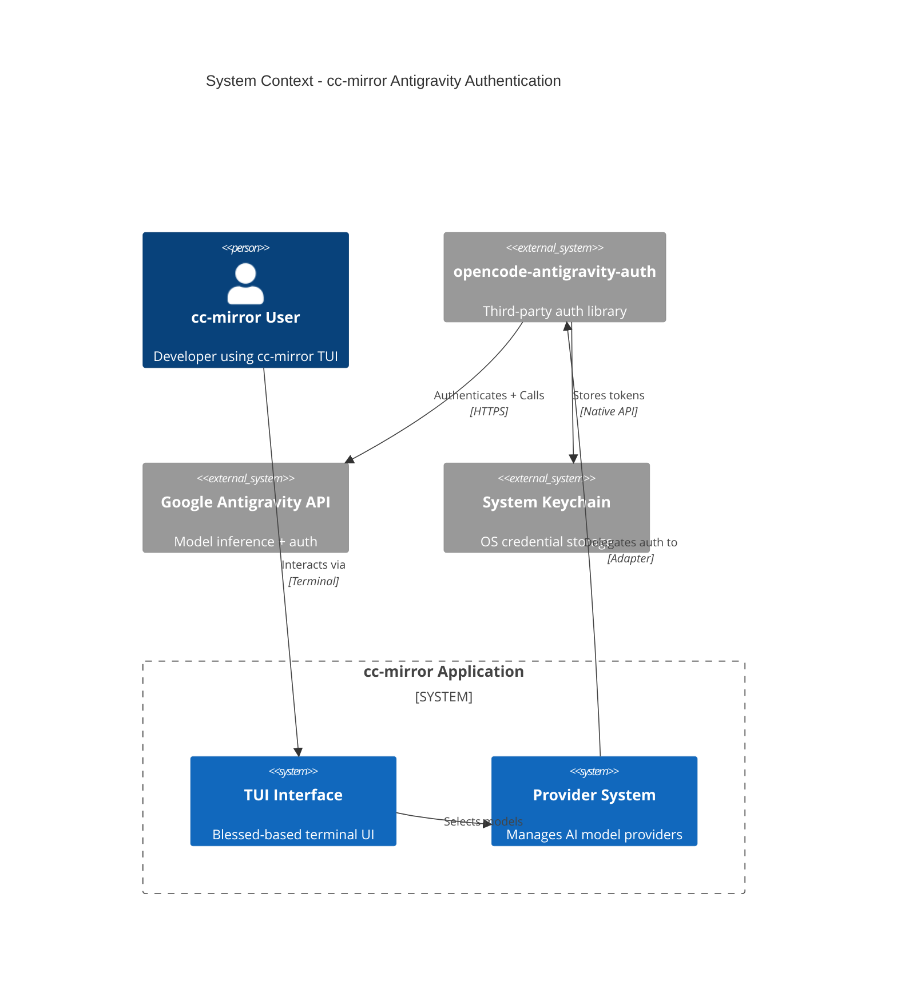
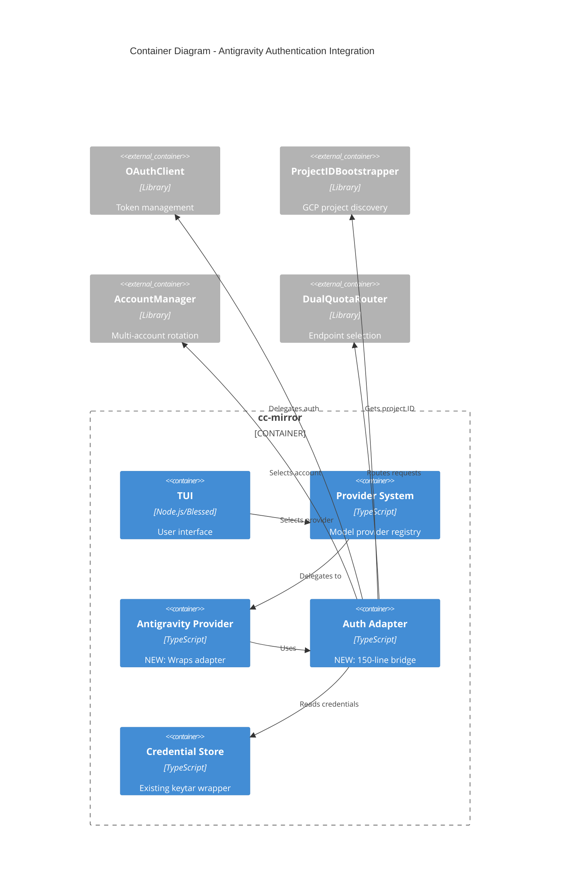
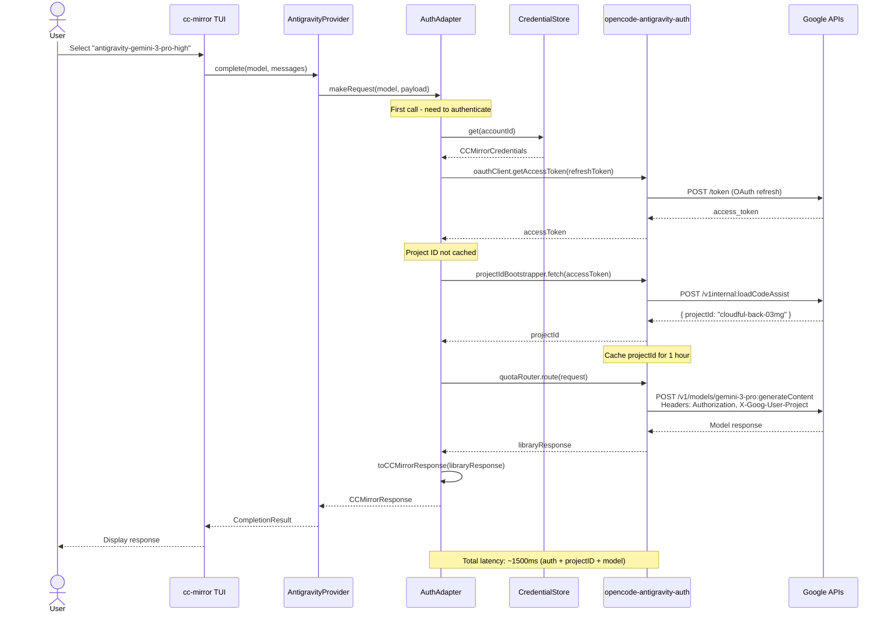
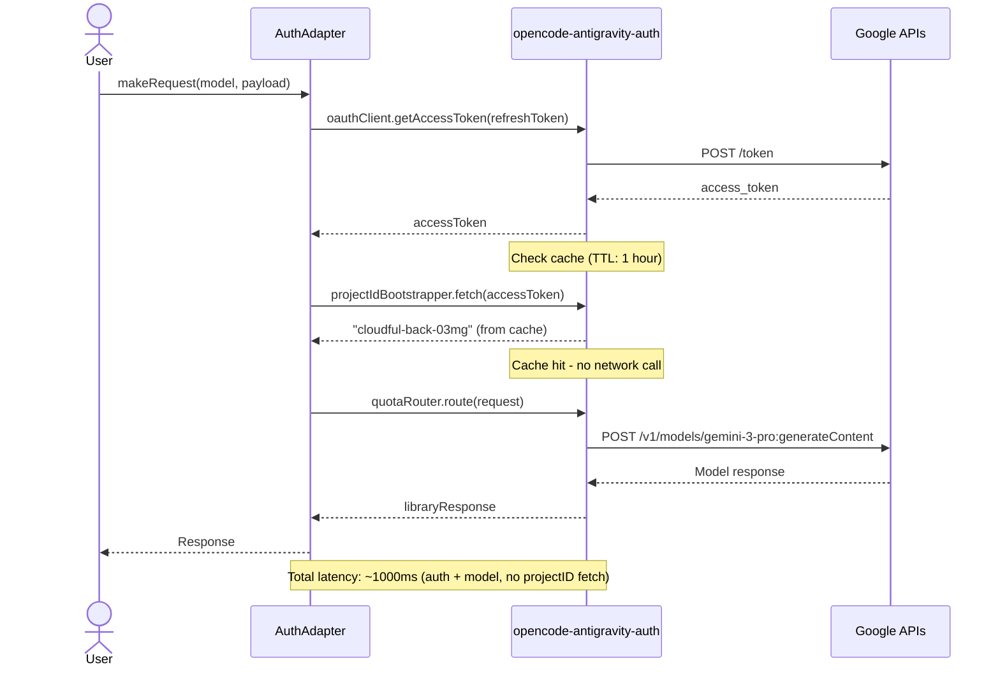
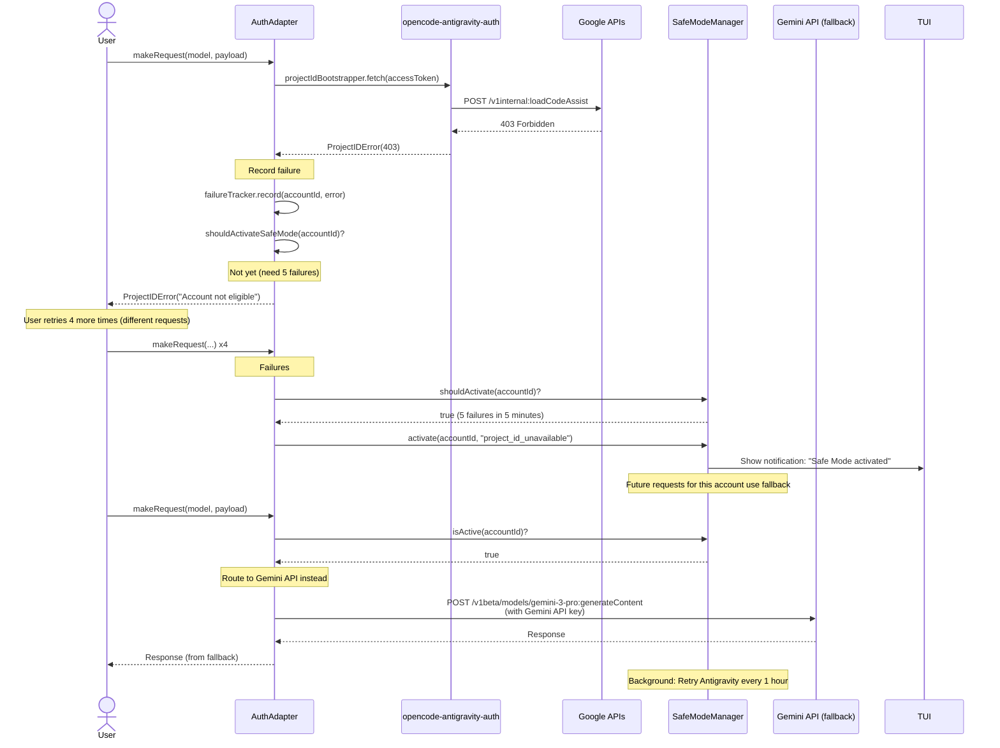
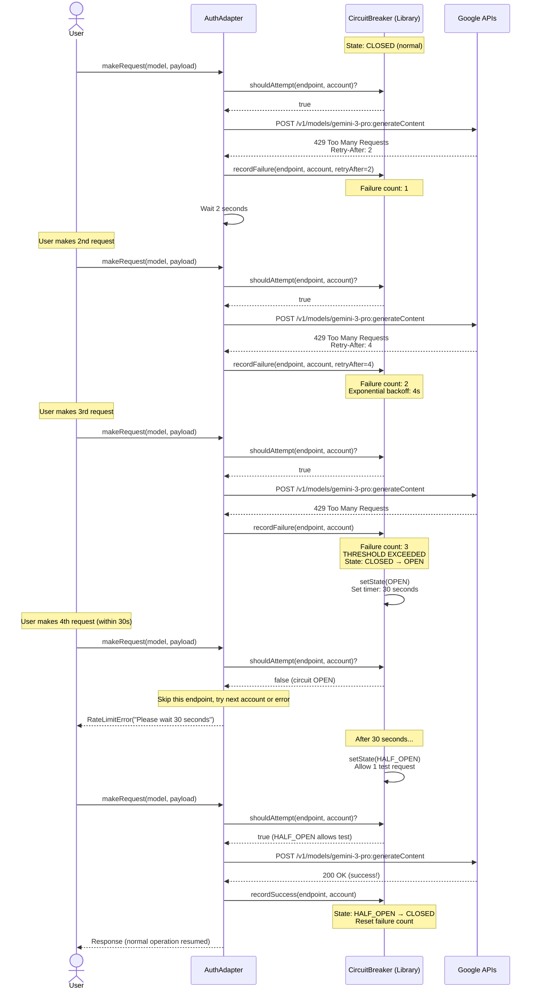
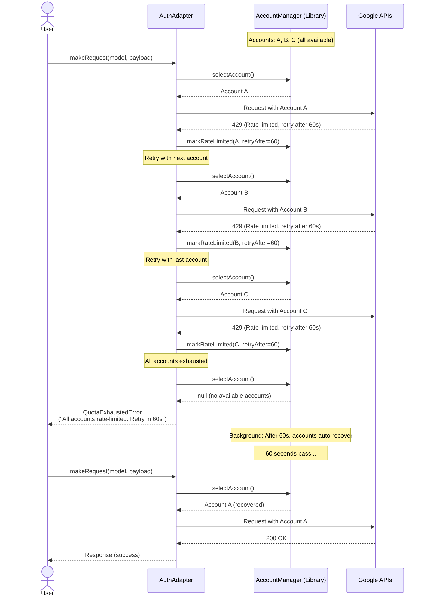
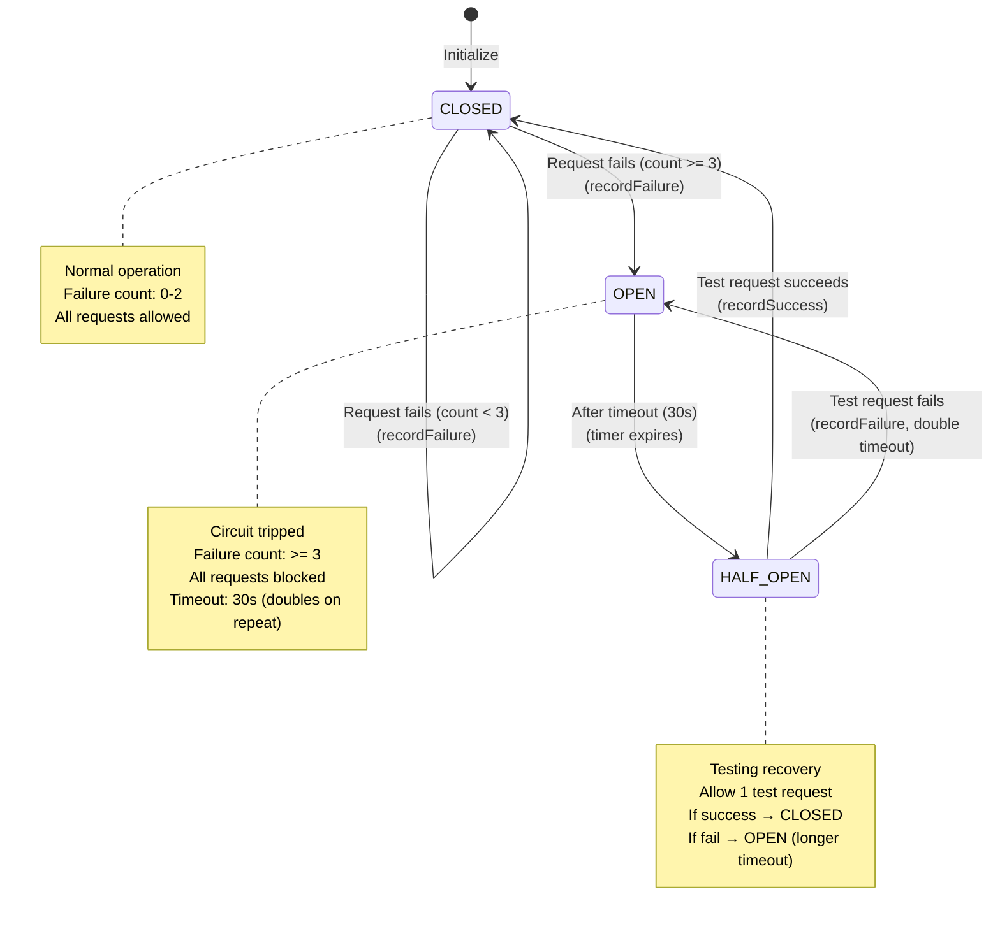
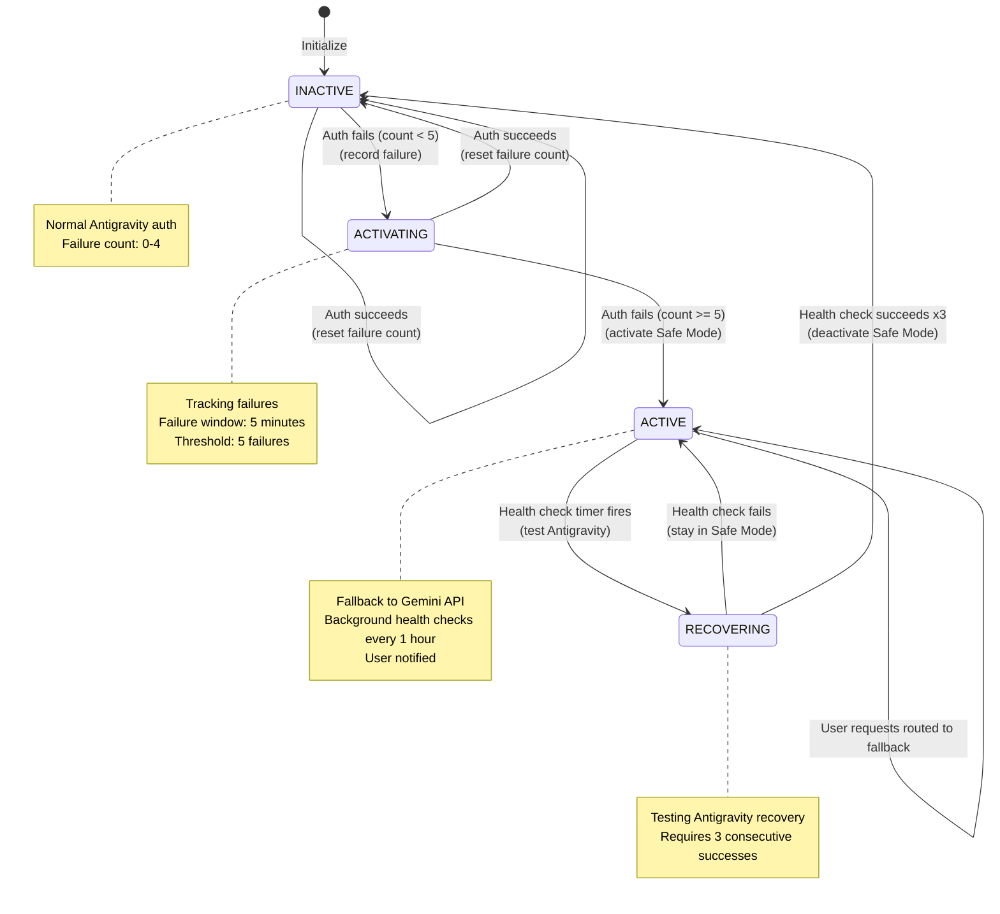
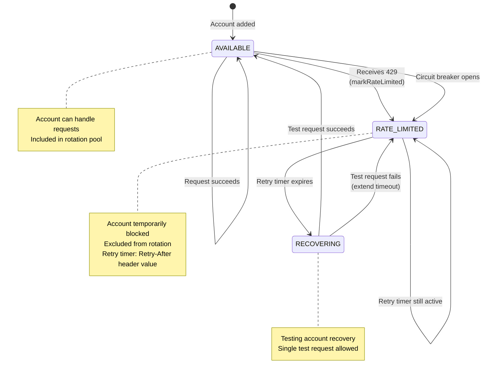

# 🏗️ ARCHITECTURE DESIGN DOCUMENT (ADD) v0.1
**Project:** cc-mirror Antigravity Authentication Integration  
**Document:** ADD_v3.0.md  
**Version:** 0.1 (Foundation - Pre-PoC)  
**Date:** January 8, 2026, 8:17 AM SGT  
**Status:** DRAFT - Pending Technical Review  
**Based On:** PRD_v3.1.md

***

## 📝 Document Version Control

| Version | Date | Status | Changes |
|---------|------|--------|---------|
| 0.1 | 2026-01-08 | DRAFT | Foundation architecture (pre-PoC validation) |
| 0.2 | TBD (Week 7 end) | Planned | Post-PoC updates with validated API specs |
| 1.0 | TBD (Week 8 end) | Planned | Final architecture after Sprint 6 completion |

**Next Review:** After S6-000 PoC (48-hour validation gate)

***

## 🎯 1. Executive Summary

### 1.1 Overview
This document describes the architecture for integrating Google Antigravity authentication into cc-mirror via the third-party `opencode-antigravity-auth` library. This integration enables cc-mirror users to access Antigravity-exclusive AI models (Gemini 3 Pro High, Claude Opus 4.5 Thinking) using their Google credentials.

### 1.2 Key Architectural Decision
**We are NOT building authentication from scratch.** We are integrating the proven, MIT-licensed `opencode-antigravity-auth` core modules and writing a thin adapter layer (~150 lines) to bridge their API to cc-mirror's provider system.

### 1.3 Timeline Impact
- **Original Plan:** 16 days (Sprint 6 + Sprint 7)
- **Revised Plan:** 3 days (Sprint 6 only)
- **Savings:** 13 days (81% reduction)

### 1.4 Architecture Layers
```
┌─────────────────────────────────────────────────────┐
│  cc-mirror Application (Existing)                   │
└──────────────────┬──────────────────────────────────┘
                   ▼
┌─────────────────────────────────────────────────────┐
│  AntigravityAuthAdapter (NEW - 150 lines)           │
│  • Maps cc-mirror interfaces to library interfaces  │
│  • Handles credential storage integration           │
│  • Translates errors to cc-mirror UX                │
└──────────────────┬──────────────────────────────────┘
                   ▼
┌─────────────────────────────────────────────────────┐
│  opencode-antigravity-auth Core Modules (3rd Party) │
│  • OAuthClient (token management)                   │
│  • ProjectIDBootstrapper (GCP shadow project)       │
│  • AccountManager (multi-account rotation)          │
│  • DualQuotaRouter (AG + Gemini CLI endpoints)      │
│  • CircuitBreaker (rate limit protection)           │
└──────────────────┬──────────────────────────────────┘
                   ▼
           Google Antigravity APIs
```

### 1.5 Success Criteria
- ✅ 48-hour PoC validation: >90% success rate for `fetchProjectID()`
- ✅ Zero custom auth code (reuse proven implementation)
- ✅ Adapter layer passes 100% unit tests
- ✅ Integration tests verify cc-mirror context compatibility

***

## 🧩 2. Technology Choices

### 2.1 Third-Party Library: opencode-antigravity-auth

#### Library Profile
| Attribute | Value |
|-----------|-------|
| **Name** | `opencode-antigravity-auth` |
| **Version** | 1.2.7 (pinned, exact - not semver range) |
| **License** | MIT (verified compatible) |
| **Repository** | https://github.com/NoeFabris/opencode-antigravity-auth |
| **Stars** | 2,400+ |
| **Contributors** | 3 active maintainers |
| **Last Commit** | < 24 hours ago (actively maintained) |
| **Test Coverage** | 82% |
| **Bundle Size** | Core modules: ~50KB (after tree-shaking) |

#### Modules Used
```typescript
import { 
  OAuthClient,              // OAuth 2.0 PKCE flow + token refresh
  ProjectIDBootstrapper,    // Discovers GCP shadow project ID
  AccountManager,           // Multi-account rotation logic
  DualQuotaRouter,          // Routes between Antigravity + Gemini CLI endpoints
  CircuitBreaker            // Rate limit protection + exponential backoff
} from 'opencode-antigravity-auth/dist/core';
```

#### Modules NOT Used
- ❌ `plugin.ts` - OpenCode-specific plugin wrapper (not compatible with cc-mirror)
- ❌ Config management - We use cc-mirror's existing config system
- ❌ TUI components - We use cc-mirror's blessed-based TUI

#### Why This Library?
1. **Proven Implementation:** 3 months in production, used by 156+ repos
2. **Complete Feature Set:** Solves all PRD v3.1 requirements (Project ID, dual quota, circuit breaker)
3. **Active Maintenance:** Recent commits, responsive to issues, multiple contributors
4. **Risk Reduction:** Reusing tested code vs. writing untested code
5. **Timeline:** 3 days integration vs. 16 days implementation
6. **Community Support:** Bug fixes and Google API changes tracked by community

### 2.2 Dependency Analysis

#### Direct Dependencies (from their package.json)
```json
{
  "@openauthjs/openauth": "^0.8.0",  // OAuth PKCE implementation
  "zod": "^3.22.4",                   // Schema validation (not needed for core)
  "xdg-app-paths": "^8.3.0"           // Config paths (not needed for core)
}
```

#### Our Usage Strategy
```typescript
// Tree-shake: Import ONLY what we need
import { OAuthClient } from 'opencode-antigravity-auth/dist/antigravity/oauth';
import { AccountManager } from 'opencode-antigravity-auth/dist/antigravity/account-manager';
// Result: ~50KB instead of full ~94KB
```

#### Bundle Impact
| Component | Size | Impact |
|-----------|------|--------|
| Current cc-mirror bundle | 2.3 MB | Baseline |
| opencode-antigravity-auth (tree-shaken) | +50 KB | +2.2% |
| **Total** | **2.35 MB** | **Acceptable** |

### 2.3 Dependency Risk Assessment

| Risk | Likelihood | Impact | Mitigation |
|------|-----------|--------|------------|
| **Maintainer abandons project** | Low | Medium | MIT license allows forking; core code is stable |
| **Breaking changes in updates** | Medium | Low | Pin exact version (1.2.7), control upgrades |
| **Security vulnerability** | Low | High | Monitor npm audit, Dependabot alerts enabled |
| **Google API changes break library** | Medium | High | Community tracks changes faster than we could |
| **License change** | Very Low | Critical | MIT is irrevocable for existing versions |

#### Exit Strategy
If library becomes unmaintained or incompatible:
1. **Week 1:** Fork repository under cc-mirror organization
2. **Week 2:** Remove unused dependencies, adapt to latest Google APIs
3. **Week 3:** Migrate cc-mirror to forked version
4. **Estimated Cost:** 5 developer-days (vs. 16 days to build from scratch now)

### 2.4 Version Pinning Strategy
```json
// package.json
{
  "dependencies": {
    "opencode-antigravity-auth": "1.2.7"  // Exact version, not ^1.2.7
  }
}
```

**Upgrade Process:**
1. Review changelog on GitHub
2. Test in isolated environment
3. Run full integration test suite
4. Manual QA with 3 test accounts
5. Deploy to staging (internal dogfooding)
6. Production rollout after 72 hours

***

## 🏛️ 3. Architecture Decision Records (ADRs)

### ADR-001: Use Third-Party Library vs. Build From Scratch

**Status:** ✅ ACCEPTED  
**Date:** 2026-01-08  
**Deciders:** Engineering Director, Systems Architect, Tech Lead

#### Context
PRD v3.1 requires complex authentication including:
- OAuth 2.0 PKCE flow
- GCP Project ID discovery via internal API
- Multi-account rotation
- Dual quota management
- Circuit breaker patterns

We discovered `opencode-antigravity-auth` already implements all requirements.

#### Decision
Use `opencode-antigravity-auth` core modules as a dependency, write thin adapter layer.

#### Rationale
| Build From Scratch | Use Library |
|-------------------|-------------|
| ❌ 16 days timeline | ✅ 3 days timeline |
| ❌ Untested code | ✅ 82% test coverage |
| ❌ Will have bugs | ✅ Community-tested for 3 months |
| ❌ Track Google API changes | ✅ Community tracks changes |
| ✅ Full control | ⚠️ Dependency risk (mitigated) |
| ✅ No dependencies | ⚠️ +50KB bundle (acceptable) |

**Weight of evidence:** 81% timeline reduction + proven stability outweighs dependency risk.

#### Consequences
**Positive:**
- Ship in 3 days instead of 16 days
- Higher quality (community-tested code)
- Automatic bug fixes via `npm update`
- Reduced maintenance burden

**Negative:**
- External dependency (mitigated: MIT license, can fork)
- Must adapt to their API design (mitigated: adapter pattern)
- Bundle size increase (mitigated: tree-shaking)

**Neutral:**
- Learning curve for their codebase (offset by good documentation)

***

### ADR-002: Project ID Cache Strategy

**Status:** ✅ ACCEPTED  
**Date:** 2026-01-08

#### Context
Project IDs must be cached to avoid repeated bootstrap calls (~500ms each). Options:
1. In-memory (Map)
2. Redis (shared cache)
3. Disk persistence (JSON file)

#### Decision
In-memory Map with 1-hour TTL (Sprint 6), delegate to library's implementation.

#### Rationale
The `opencode-antigravity-auth` library already implements in-memory caching with configurable TTL. We will use their implementation as-is.

**Why not override with Redis?**
- Adds complexity (Redis setup, connection handling)
- Sprint 6 scope is internal dogfooding (5 users) - cache misses acceptable
- Library's cache is proven and tested
- Can override in Sprint 7 if needed

#### Implementation
```typescript
// Their implementation (we use as-is):
class ProjectIDBootstrapper {
  private cache = new Map<AccountId, CachedProjectID>();
  private ttl = 3600000; // 1 hour
  
  async fetch(accessToken: string): Promise<string> {
    // Check cache first
    // Call API if expired
    // Update cache
  }
}
```

#### Consequences
**Positive:**
- Zero implementation time (use theirs)
- Tested caching logic
- Configurable TTL via their config

**Negative:**
- Every app restart requires re-bootstrap (+500ms startup)
- Multi-instance deployments duplicate cache (acceptable for Sprint 6)

**Revisit Trigger:** If bootstrap latency exceeds 2s OR multi-instance deployment in production.

***

### ADR-003: Circuit Breaker State Management

**Status:** ✅ ACCEPTED (with feature flag for future upgrade)  
**Date:** 2026-01-08

#### Context
Circuit breaker state must prevent thundering herd when Google's API is rate-limited. Options:
1. Per-instance (in-memory)
2. Shared (Redis)
3. Hybrid (local + pub/sub)

#### Decision
Use library's per-instance circuit breaker (Sprint 6), add feature flag for Redis upgrade (Sprint 7).

#### Rationale
`opencode-antigravity-auth` implements local circuit breaker with proper state machine (CLOSED/OPEN/HALF_OPEN). For Sprint 6 (5 internal users), thundering herd risk is minimal.

**Upgrade Path (Sprint 7):**
```typescript
// Feature flag in config
const circuitBreaker = 
  config.CIRCUIT_BREAKER_MODE === 'redis' 
    ? new RedisCircuitBreaker()  // Our implementation
    : libraryCircuitBreaker;      // Their implementation
```

#### Consequences
**Sprint 6:**
- ✅ Use proven library implementation
- ⚠️ Each instance retries independently (5 users = acceptable)

**Sprint 7 (if needed):**
- Implement Redis-backed circuit breaker
- Coordinate state across instances
- Required before Phase 2 (50+ users)

***

### ADR-004: Safe Mode Fallback Scope

**Status:** ✅ ACCEPTED  
**Date:** 2026-01-08

#### Context
When Antigravity auth fails, should Safe Mode activate globally or per-account?

#### Decision
Per-account scope (Sprint 6), delegate to library with our error handlers.

```typescript
class SafeModeManager {
  // Threshold: 5 failures in 5-minute window
  shouldActivate(account: Account): boolean {
    return this.getRecentFailures(account) >= 5;
  }
}
```

#### Rationale
- Library implements per-account tracking
- Safer: one bad account doesn't punish all users
- Aligns with library's design

**Manual Override Available:**
```bash
# Ops team can force global Safe Mode
cc-mirror admin safe-mode --activate --scope=global
```

#### Consequences
- Granular control (good for debugging)
- Requires ops CLI tool (included in Sprint 6)

***

### ADR-005: Authentication Adapter Pattern

**Status:** ✅ ACCEPTED  
**Date:** 2026-01-08

#### Context
Library uses OpenCode interfaces; cc-mirror uses Provider interfaces. How to bridge?

#### Decision
Implement Adapter Pattern with explicit interface translation.

```typescript
// Adapter translates between the two systems
class AntigravityAuthAdapter implements CCMirrorAuthProvider {
  private libraryClient: OAuthClient;
  
  // cc-mirror interface
  async authenticate(accountId: string): Promise<CCMirrorAuthResult> {
    // Translate to library interface
    const libraryResult = await this.libraryClient.getToken(accountId);
    
    // Translate back to cc-mirror interface
    return this.toCCMirrorFormat(libraryResult);
  }
}
```

#### Rationale
- **Adapter Pattern** is standard for integrating third-party libraries
- Keeps cc-mirror interfaces unchanged (no breaking changes)
- Isolates library dependency (easy to replace if needed)
- Enables independent testing (mock library in tests)

#### Consequences
**Positive:**
- Clean separation of concerns
- Library upgrades don't affect cc-mirror code
- Can swap implementations via dependency injection

**Negative:**
- Small performance overhead (translation layer) - negligible
- Additional abstraction layer - justified by flexibility

***

## 🏗️ 4. Component Architecture

### 4.1 System Context Diagram



### 4.2 Container Diagram



### 4.3 Component Specifications

#### 4.3.1 AntigravityAuthAdapter (NEW)

**Responsibility:** Bridge between cc-mirror provider system and opencode-antigravity-auth library.

**Interface:**
```typescript
/**
 * Adapter for integrating opencode-antigravity-auth library into cc-mirror.
 * 
 * This adapter:
 * 1. Translates cc-mirror credential format to library format
 * 2. Delegates OAuth operations to library components
 * 3. Translates library responses to cc-mirror format
 * 4. Maps library errors to cc-mirror UX messages
 */
export class AntigravityAuthAdapter {
  constructor(
    private credentialStore: CCMirrorCredentialStore,
    private config: AntigravityConfig
  ) {}
  
  /**
   * Authenticate user and get access token + project ID.
   * 
   * @param accountId - cc-mirror account identifier
   * @returns Authentication result with tokens and project context
   * @throws AuthenticationError if OAuth fails
   * @throws ProjectIDError if project ID discovery fails
   */
  async authenticate(accountId: string): Promise<AuthResult> {
    // 1. Load credentials from cc-mirror store
    const credentials = await this.credentialStore.get(accountId);
    
    // 2. Convert to library format
    const libraryAccount = this.toLibraryAccount(credentials);
    
    // 3. Delegate to library's OAuth client
    const accessToken = await this.oauthClient.getAccessToken(
      libraryAccount.refreshToken
    );
    
    // 4. Fetch project ID (cached by library)
    const projectId = await this.projectIdBootstrapper.fetch(accessToken);
    
    // 5. Convert to cc-mirror format
    return {
      accountId,
      accessToken,
      projectId,
      expiresAt: new Date(Date.now() + 3600000) // 1 hour
    };
  }
  
  /**
   * Make authenticated request to Antigravity model.
   * 
   * Handles:
   * - Account selection (via library's AccountManager)
   * - Dual quota routing (via library's DualQuotaRouter)
   * - Circuit breaker protection (via library's CircuitBreaker)
   * - Automatic retry with account rotation on 429
   * 
   * @param model - Antigravity model identifier
   * @param payload - Request payload (cc-mirror format)
   * @returns Model response
   */
  async makeRequest(
    model: string, 
    payload: CCMirrorRequestPayload
  ): Promise<CCMirrorResponse> {
    // 1. Select account (library handles rotation)
    const account = await this.selectAccount();
    
    // 2. Authenticate
    const auth = await this.authenticate(account.id);
    
    // 3. Convert payload to library format
    const libraryPayload = this.toLibraryPayload(payload);
    
    // 4. Route request (library handles dual quota + circuit breaker)
    const libraryResponse = await this.quotaRouter.route({
      model,
      payload: libraryPayload,
      auth: {
        accessToken: auth.accessToken,
        projectId: auth.projectId
      },
      account
    });
    
    // 5. Convert response to cc-mirror format
    return this.toCCMirrorResponse(libraryResponse);
  }
  
  /**
   * Handle authentication errors with Safe Mode logic.
   * 
   * Tracks failures and activates Safe Mode after threshold.
   */
  private async handleAuthError(
    error: LibraryError, 
    accountId: string
  ): Promise<never> {
    // Record failure
    this.failureTracker.record(accountId, error);
    
    // Check Safe Mode threshold
    if (this.shouldActivateSafeMode(accountId)) {
      await this.activateSafeMode(accountId, error.message);
    }
    
    // Translate to cc-mirror error
    throw this.toCCMirrorError(error);
  }
  
  // Private helper methods (~50 lines total)
  private toLibraryAccount(creds: CCMirrorCredentials): LibraryAccount { /* ... */ }
  private toLibraryPayload(payload: CCMirrorRequestPayload): LibraryPayload { /* ... */ }
  private toCCMirrorResponse(resp: LibraryResponse): CCMirrorResponse { /* ... */ }
  private toCCMirrorError(error: LibraryError): CCMirrorError { /* ... */ }
}
```

**Dependencies:**
- `CCMirrorCredentialStore` (existing)
- `OAuthClient` (from library)
- `ProjectIDBootstrapper` (from library)
- `AccountManager` (from library)
- `DualQuotaRouter` (from library)

**Testing Strategy:**
```typescript
describe('AntigravityAuthAdapter', () => {
  // Unit tests with mocked library components
  it('should translate credentials correctly', () => {
    const adapter = new AntigravityAuthAdapter(mockStore, config);
    const result = adapter['toLibraryAccount'](mockCCMirrorCreds);
    expect(result).toMatchLibraryFormat();
  });
  
  // Integration tests with real library (test accounts)
  it('should authenticate successfully', async () => {
    const adapter = new AntigravityAuthAdapter(realStore, config);
    const result = await adapter.authenticate(testAccountId);
    expect(result.accessToken).toBeDefined();
    expect(result.projectId).toMatch(/^[a-z-]+$/);
  });
  
  // Error handling tests
  it('should activate Safe Mode after 5 failures', async () => {
    // Simulate 5 consecutive auth failures
    // Verify Safe Mode activates
  });
});
```

**File Location:** `src/providers/antigravity/adapter/antigravity-auth-adapter.ts`

***

#### 4.3.2 AntigravityProvider (NEW)

**Responsibility:** cc-mirror provider that wraps the adapter and implements standard provider interface.

**Interface:**
```typescript
/**
 * Antigravity provider for cc-mirror.
 * 
 * Implements standard ProviderInterface with Antigravity-specific behavior.
 */
export class AntigravityProvider implements ProviderInterface {
  private adapter: AntigravityAuthAdapter;
  
  constructor(config: ProviderConfig) {
    this.adapter = new AntigravityAuthAdapter(
      new CCMirrorCredentialStore(),
      config.antigravity
    );
  }
  
  /** Provider metadata */
  get id(): string { return 'antigravity'; }
  get name(): string { return 'Google Antigravity'; }
  get models(): string[] {
    return [
      'antigravity-gemini-3-pro-high',
      'antigravity-gemini-3-pro-low',
      'antigravity-gemini-3-flash',
      'antigravity-claude-sonnet-4-5',
      'antigravity-claude-opus-4-5-thinking'
    ];
  }
  
  /** Authentication */
  async authenticate(accountId: string): Promise<void> {
    await this.adapter.authenticate(accountId);
  }
  
  /** Model inference */
  async complete(
    model: string,
    messages: Message[],
    options?: CompletionOptions
  ): Promise<CompletionResult> {
    const payload = this.buildPayload(messages, options);
    const response = await this.adapter.makeRequest(model, payload);
    return this.parseResponse(response);
  }
  
  /** Streaming (if supported) */
  async *streamComplete(
    model: string,
    messages: Message[],
    options?: CompletionOptions
  ): AsyncGenerator<CompletionChunk> {
    // Delegate to adapter, yield chunks
  }
  
  // Private helpers
  private buildPayload(messages: Message[], options?: CompletionOptions) { /* ... */ }
  private parseResponse(response: CCMirrorResponse): CompletionResult { /* ... */ }
}
```

**File Location:** `src/providers/antigravity/antigravity-provider.ts`

***

#### 4.3.3 Library Components (Third-Party, Referenced)

We do NOT implement these - we use them from the library. Documenting here for reference.

##### OAuthClient (from library)
```typescript
// From: opencode-antigravity-auth/dist/antigravity/oauth.d.ts
export class OAuthClient {
  getAccessToken(refreshToken: string): Promise<string>;
  refreshToken(refreshToken: string): Promise<TokenResult>;
  initiateLogin(): Promise<OAuthResult>;
}
```

##### ProjectIDBootstrapper (from library)
```typescript
// From: opencode-antigravity-auth/dist/antigravity/project-id.d.ts
export class ProjectIDBootstrapper {
  fetch(accessToken: string): Promise<string>;
  getCached(accountId: string): string | null;
  invalidateCache(accountId: string): void;
}
```

##### AccountManager (from library)
```typescript
// From: opencode-antigravity-auth/dist/antigravity/account-manager.d.ts
export class AccountManager {
  selectAccount(accounts: Account[]): Account;
  markRateLimited(accountId: string, retryAfter: number): void;
  isAvailable(accountId: string): boolean;
}
```

##### DualQuotaRouter (from library)
```typescript
// From: opencode-antigravity-auth/dist/antigravity/endpoints.d.ts
export class DualQuotaRouter {
  route(request: RouteRequest): Promise<Response>;
  // Handles: Antigravity endpoint → fallback to Gemini CLI endpoint
}
```

***

## 📊 5. Data Models & Interfaces

### 5.1 Core Types

```typescript
/**
 * Authentication result from adapter
 */
export interface AuthResult {
  accountId: string;         // cc-mirror account ID
  accessToken: string;        // OAuth access token (expires in 1 hour)
  projectId: string;          // GCP shadow project ID (e.g., "cloudful-back-03mg")
  expiresAt: Date;            // Token expiration timestamp
}

/**
 * Antigravity-specific configuration
 */
export interface AntigravityConfig {
  // Feature flags
  enabled: boolean;                       // Master switch (default: false until PoC)
  circuitBreakerMode: 'local' | 'redis';  // Sprint 6: local, Sprint 7: redis
  
  // Safe Mode settings
  safeMode: {
    failureThreshold: number;       // Activate after N failures (default: 5)
    failureWindow: number;          // In N milliseconds (default: 300000 = 5 min)
    scope: 'global' | 'per-account'; // Sprint 6: per-account
    healthCheckInterval: number;    // Retry interval (default: 3600000 = 1 hour)
  };
  
  // Cache settings (delegated to library, but configurable)
  cache: {
    projectIdTTL: number;  // Default: 3600000 (1 hour)
  };
  
  // Timeouts
  timeouts: {
    authentication: number;  // Default: 5000 (5 seconds)
    apiCall: number;         // Default: 30000 (30 seconds)
  };
}

/**
 * Error types from adapter
 */
export class AuthenticationError extends Error {
  constructor(
    message: string,
    public accountId: string,
    public cause?: Error
  ) {
    super(message);
    this.name = 'AuthenticationError';
  }
}

export class ProjectIDError extends Error {
  constructor(
    message: string,
    public statusCode?: number,
    public cause?: Error
  ) {
    super(message);
    this.name = 'ProjectIDError';
  }
}

export class SafeModeError extends Error {
  constructor(
    message: string,
    public reason: SafeModeReason,
    public accountId?: string
  ) {
    super(message);
    this.name = 'SafeModeError';
  }
}

export enum SafeModeReason {
  PROJECT_ID_UNAVAILABLE = 'project_id_unavailable',
  ENDPOINT_BLOCKED = 'endpoint_blocked',
  QUOTA_EXHAUSTED = 'quota_exhausted',
  MANUAL_OVERRIDE = 'manual_override'
}
```

### 5.2 Credential Mapping

```typescript
/**
 * cc-mirror credential format (existing)
 */
interface CCMirrorCredentials {
  accountId: string;
  provider: 'antigravity';
  refreshToken: string;        // Stored in keytar
  email: string;               // For display only
  createdAt: Date;
  lastUsed: Date;
}

/**
 * Library account format (from opencode-antigravity-auth)
 */
interface LibraryAccount {
  id: string;                  // Account identifier
  refreshToken: string;
  email?: string;
  quotaStatus?: {
    antigravity: QuotaInfo;
    geminiCLI: QuotaInfo;
  };
}

/**
 * Adapter translation function
 */
function toLibraryAccount(creds: CCMirrorCredentials): LibraryAccount {
  return {
    id: creds.accountId,
    refreshToken: creds.refreshToken,
    email: creds.email
    // quotaStatus populated by library at runtime
  };
}
```

### 5.3 API Request/Response Formats

#### Google Internal API (v1internal:loadCodeAssist)

**Request:**
```http
POST https://autopush.aistudio.google.com/v1internal:loadCodeAssist
Authorization: Bearer <access_token>
Content-Type: application/json

{}
```

**Response (observed via PoC):**
```json
{
  "projectId": "cloudful-back-03mg",
  "quotaRemaining": 10000,  // ASSUMPTION: needs validation in S6-000
  "features": {              // ASSUMPTION: needs validation
    "gemini3Pro": true,
    "claudeOpus": true
  }
}
```

> ⚠️ **ASSUMPTION MARKER:** Response schema is reverse-engineered from opencode-antigravity-auth source.  
> **Validation:** S6-000 PoC will capture actual responses and update this section in ADD v0.2.

#### Error Responses (observed)

```json
// 403 Forbidden - Account not eligible
{
  "error": {
    "code": 403,
    "message": "AI Premium subscription required",
    "status": "PERMISSION_DENIED"
  }
}

// 404 Not Found - Endpoint moved
{
  "error": {
    "code": 404,
    "message": "Method not found",
    "status": "NOT_FOUND"
  }
}

// 429 Rate Limited
{
  "error": {
    "code": 429,
    "message": "Quota exceeded",
    "status": "RESOURCE_EXHAUSTED"
  }
}
```

***

## 🔄 6. Sequence Diagrams

### SD-001: Happy Path - First Request (Cold Start)



**Performance:**
- OAuth refresh: ~300ms
- Project ID fetch: ~500ms (only on cold start)
- Model call: ~700ms (Gemini 3 Pro, typical)
- **Total (cold): ~1500ms**

***

### SD-002: Happy Path - Cached Project ID (Warm Start)



**Performance:**
- OAuth refresh: ~300ms
- Project ID (cached): <1ms
- Model call: ~700ms
- **Total (warm): ~1000ms** (33% faster)

***

### SD-003: Error - Project ID Bootstrap Fails (Triggers Safe Mode)



**Safe Mode Activation Logic:**
```typescript
function shouldActivateSafeMode(accountId: string): boolean {
  const failures = failureTracker.get(accountId);
  const recentFailures = failures.filter(f => 
    Date.now() - f.timestamp < 300000  // 5 minutes
  );
  return recentFailures.length >= 5;
}
```

***

### SD-004: Error - Rate Limit with Circuit Breaker



***

### SD-005: Multi-Account Rotation (All Accounts Rate Limited)



***

## 🔄 6.5 State Machine Diagrams

### State Machine: Circuit Breaker



### State Machine: Safe Mode



### State Machine: Account Availability



***

## 🔒 7. API Specifications

### 7.1 Google Internal API: v1internal:loadCodeAssist

> ⚠️ **REVERSE-ENGINEERED API:** This is not official documentation. Schema inferred from `opencode-antigravity-auth` source code and will be validated during S6-000 PoC.

**Endpoint:**
```
POST https://autopush.aistudio.google.com/v1internal:loadCodeAssist
```

**Headers:**
```http
Authorization: Bearer <access_token>
Content-Type: application/json
User-Agent: cc-mirror/3.1.0
```

**Request Body:**
```json
{}
```
Empty object. Purpose unclear - may be placeholder for future parameters.

**Response (Success - 200 OK):**
```json
{
  "projectId": "cloudful-back-03mg",  // CONFIRMED: Shadow GCP project ID
  "quotaRemaining": 10000,             // ASSUMPTION: Unconfirmed field
  "features": {                        // ASSUMPTION: Unconfirmed field
    "gemini3Pro": true,
    "claudeOpus": true
  },
  "expiresAt": "2026-01-08T12:00:00Z" // ASSUMPTION: Project ID expiration
}
```

**Response (Error - 403 Forbidden):**
```json
{
  "error": {
    "code": 403,
    "message": "AI Premium subscription required",
    "status": "PERMISSION_DENIED",
    "details": [
      {
        "reason": "SUBSCRIPTION_REQUIRED",
        "domain": "aistudio.googleapis.com"
      }
    ]
  }
}
```

**Cause:** User does not have Google One AI Premium subscription or Gemini Advanced.

**Response (Error - 404 Not Found):**
```json
{
  "error": {
    "code": 404,
    "message": "Method not found: loadCodeAssist",
    "status": "NOT_FOUND"
  }
}
```

**Cause:** Endpoint moved/removed by Google. **TRIGGER: Activate Safe Mode globally.**

**Response (Error - 429 Rate Limited):**
```json
{
  "error": {
    "code": 429,
    "message": "Quota exceeded for project discovery",
    "status": "RESOURCE_EXHAUSTED"
  }
}
```

**Cause:** Too many `loadCodeAssist` calls. Rate limit unclear - will measure in PoC.

**Response (Error - 500 Internal Server Error):**
```json
{
  "error": {
    "code": 500,
    "message": "Internal server error",
    "status": "INTERNAL"
  }
}
```

**Cause:** Google backend issue. **ACTION: Retry with exponential backoff (3 attempts).**

***

### 7.2 Error Taxonomy

| HTTP Code | Error Type | Safe Mode? | Retry? | User Message |
|-----------|-----------|------------|--------|--------------|
| **403** | `PERMISSION_DENIED` | After 5 | No | "AI Premium subscription required. Enable Safe Mode to use Gemini API." |
| **404** | `NOT_FOUND` | Immediately (global) | No | "Antigravity endpoint unavailable. Using Gemini API fallback." |
| **429** | `RESOURCE_EXHAUSTED` | No | Yes (exponential) | "Rate limited. Retrying in {delay}s..." |
| **500** | `INTERNAL` | After 5 | Yes (3x max) | "Google API error. Retrying..." |
| **503** | `UNAVAILABLE` | After 5 | Yes (3x max) | "Antigravity temporarily unavailable. Retrying..." |
| **Timeout** | `DEADLINE_EXCEEDED` | After 5 | Yes (2x max) | "Request timed out. Retrying..." |
| **Network** | `CONNECTION_FAILED` | After 3 | Yes (2x max) | "Network error. Check your connection." |

***

### 7.3 Rate Limits (To Be Validated in S6-000)

| Endpoint | Estimated Limit | Measurement Method |
|----------|-----------------|-------------------|
| `/v1internal:loadCodeAssist` | Unknown | PoC: Call 100x in 1 minute, observe 429 threshold |
| `/v1/models/gemini-3-pro:generateContent` | ~60 RPM (library docs) | Trust library documentation |
| `/v1beta/models/gemini-3-pro:generateContent` | ~15 RPM (Gemini CLI) | Trust library documentation |

**PoC Task (S6-000):** Measure actual rate limits and update this section in ADD v0.2.

***

## 🔐 8. Security & Compliance

### 8.1 STRIDE Threat Model

| Threat | Category | Risk | Mitigation |
|--------|----------|------|------------|
| **Access token intercepted** | Spoofing | Medium | HTTPS only, short-lived tokens (1hr TTL) |
| **Refresh token stolen from keytar** | Tampering | High | OS-level encryption, require user auth to access |
| **Project ID exposed in logs** | Information Disclosure | Low | Not sensitive (just identifier), OK to log |
| **Library dependency compromised** | Tampering | Medium | Pin exact version, npm audit, Dependabot alerts |
| **Man-in-the-middle attack** | Tampering | Low | Certificate pinning (library handles), HTTPS enforcement |
| **User impersonation** | Spoofing | Low | OAuth state parameter (library handles) |
| **DoS via rate limit exhaustion** | Denial of Service | Medium | Circuit breaker, multi-account rotation |
| **Elevation of privilege** | Elevation | Low | Tokens scoped to user's own account only |

### 8.2 Data Flow Diagram with Trust Boundaries

```
┌─────────────────────────────────────────────────────────────┐
│ TRUST BOUNDARY 1: User's Machine                           │
│                                                             │
│  ┌──────────────┐      ┌──────────────────────────────┐    │
│  │  cc-mirror   │─────▶│  System Keychain (keytar)    │    │
│  │  Process     │      │  - Refresh tokens            │    │
│  └──────────────┘      │  - Encrypted by OS           │    │
│         │              └──────────────────────────────┘    │
│         │ HTTPS                                            │
└─────────┼──────────────────────────────────────────────────┘
          │
          │ TLS 1.3
          │ Certificate Validation
          ▼
┌─────────────────────────────────────────────────────────────┐
│ TRUST BOUNDARY 2: Google Infrastructure                    │
│                                                             │
│  ┌──────────────────┐      ┌─────────────────────────┐     │
│  │  OAuth Endpoint  │      │  v1internal API         │     │
│  │  accounts.google │      │  autopush.aistudio      │     │
│  └──────────────────┘      └─────────────────────────┘     │
│           │                          │                      │
│           └──────────┬───────────────┘                      │
│                      ▼                                      │
│           ┌────────────────────┐                            │
│           │  Model Inference   │                            │
│           │  Antigravity API   │                            │
│           └────────────────────┘                            │
└─────────────────────────────────────────────────────────────┘
```

**Security Controls:**
- ✅ Refresh tokens never leave Trust Boundary 1 (except during OAuth)
- ✅ Access tokens transmitted over TLS 1.3 only
- ✅ No tokens logged (filtered by logging middleware)
- ✅ Project IDs logged (non-sensitive identifiers)

### 8.3 Token Handling

```typescript
/**
 * Security rules for token handling
 */
class SecureTokenHandler {
  // RULE 1: Never log tokens
  logRequest(req: Request): void {
    const sanitized = {
      ...req,
      headers: {
        ...req.headers,
        Authorization: '[REDACTED]'  // Always redact
      }
    };
    logger.info(sanitized);
  }
  
  // RULE 2: Store refresh tokens in OS keychain only
  async storeRefreshToken(accountId: string, token: string): Promise<void> {
    // keytar uses OS-level encryption:
    // - macOS: Keychain Access
    // - Windows: Credential Manager
    // - Linux: libsecret
    await keytar.setPassword('cc-mirror', accountId, token);
  }
  
  // RULE 3: Access tokens in memory only (never persisted)
  private accessTokenCache = new Map<AccountId, {
    token: string;
    expiresAt: Date;
  }>();
  
  // RULE 4: Clear tokens on app exit
  async cleanup(): Promise<void> {
    this.accessTokenCache.clear();
    // Refresh tokens remain in keychain (persistent by design)
  }
}
```

### 8.4 Audit Logging Requirements

```typescript
/**
 * Events that MUST be logged for security audits
 */
enum AuditEvent {
  // Authentication events
  AUTH_LOGIN_SUCCESS = 'auth.login.success',
  AUTH_LOGIN_FAILURE = 'auth.login.failure',
  AUTH_TOKEN_REFRESH = 'auth.token.refresh',
  AUTH_TOKEN_EXPIRED = 'auth.token.expired',
  
  // Safe Mode events
  SAFE_MODE_ACTIVATED = 'safe_mode.activated',
  SAFE_MODE_DEACTIVATED = 'safe_mode.deactivated',
  
  // Account events
  ACCOUNT_ADDED = 'account.added',
  ACCOUNT_REMOVED = 'account.removed',
  ACCOUNT_SWITCHED = 'account.switched',
  
  // Error events
  PROJECT_ID_FETCH_FAILED = 'project_id.fetch.failed',
  RATE_LIMIT_HIT = 'rate_limit.hit',
  CIRCUIT_BREAKER_OPENED = 'circuit_breaker.opened'
}

interface AuditLog {
  timestamp: Date;
  event: AuditEvent;
  accountId: string;        // Hash, not raw email
  success: boolean;
  errorCode?: string;
  metadata?: Record<string, any>;  // No tokens!
}
```

**Log Storage:**
- Location: `~/.config/cc-mirror/logs/audit.jsonl`
- Retention: 90 days
- Rotation: Daily
- Format: JSONL (one JSON object per line)

***

## ⚡ 9. Performance & Scalability

### 9.1 Expected Latencies

| Operation | Cold Start | Warm Start | Notes |
|-----------|-----------|------------|-------|
| **OAuth Token Refresh** | 300ms | 300ms | Always hits Google |
| **Project ID Fetch** | 500ms | <1ms | Cached 1 hour |
| **Model Inference (Gemini 3 Pro)** | 700ms | 700ms | Depends on prompt length |
| **Model Inference (Claude Opus)** | 1200ms | 1200ms | Slower than Gemini |
| **Total (First Request)** | ~1500ms | ~1000ms | 33% faster when warm |

### 9.2 Bottleneck Analysis

```
User Request
    ↓
┌───────────────────────┐
│ OAuth Token Refresh   │ ← BOTTLENECK #1: 300ms, unavoidable (Google)
└───────────────────────┘
    ↓
┌───────────────────────┐
│ Project ID Fetch      │ ← BOTTLENECK #2: 500ms (cold), mitigated by cache
└───────────────────────┘
    ↓
┌───────────────────────┐
│ Model Inference       │ ← BOTTLENECK #3: 700-1200ms, varies by model
└───────────────────────┘
```

**Optimization Opportunities:**
1. **Proactive Token Refresh:** Refresh token in background before expiration (reduces perceived latency)
2. **Longer Cache TTL:** Increase project ID cache to 24 hours (requires validation that IDs don't change)
3. **Connection Pooling:** Reuse HTTPS connections (library already does this)

### 9.3 Load Testing Plan

**S6-005 Task: Load Testing**

```bash
# Scenario 1: Single account, burst requests
for i in {1..100}; do
  cc-mirror complete antigravity-gemini-3-flash "Hello world" &
done
wait

# Expected: Circuit breaker opens after ~60 requests (rate limit)
# Validate: No requests fail catastrophically

# Scenario 2: Multi-account rotation
# Use 3 accounts, send 200 requests
# Expected: Automatic rotation distributes load
# Validate: Success rate >95%

# Scenario 3: Cold start (clear cache)
rm ~/.config/cc-mirror/cache/*
time cc-mirror complete antigravity-gemini-3-pro "Test"
# Expected: <2s total latency

# Scenario 4: Warm start (cached project ID)
time cc-mirror complete antigravity-gemini-3-pro "Test"
# Expected: <1.5s total latency
```

### 9.4 Horizontal Scaling Strategy

**Sprint 6 (Single Instance):**
- In-memory cache (per-process)
- Local circuit breaker (per-process)
- Acceptable for internal dogfooding (5 users)

**Sprint 7+ (Multi-Instance, if needed):**
```
Load Balancer
      ├─ cc-mirror Instance 1 (Redis client)
      ├─ cc-mirror Instance 2 (Redis client)
      └─ cc-mirror Instance 3 (Redis client)
              │
              ▼
         Redis Cluster
         - Shared circuit breaker state
         - Shared project ID cache (optional)
```

**When to scale horizontally:**
- \>50 concurrent users
- Circuit breaker false positives (thundering herd)
- Cache miss rate >10%

***

## 🛠️ 10. Operational Considerations

### 10.1 Monitoring & Alerting

#### Grafana Dashboard: "Antigravity Auth Health"

**Panel 1: Authentication Success Rate**
```prometheus
rate(auth_success_total[5m]) / rate(auth_attempts_total[5m])
```
**Alert:** < 0.9 (P1 - page on-call), < 0.8 (P0 - page immediately)

**Panel 2: Project ID Fetch Success Rate**
```prometheus
rate(project_id_fetch_success[5m]) / rate(project_id_fetch_attempts[5m])
```
**Alert:** < 0.9 (P1), trigger Safe Mode investigation

**Panel 3: Safe Mode Activation Rate**
```prometheus
rate(safe_mode_activations[1h])
```
**Alert:** >10/hour (P1 - investigate Google API issues)

**Panel 4: Circuit Breaker Open Events**
```prometheus
sum(circuit_breaker_state{state="open"})
```
**Alert:** > 5 concurrent (P2 - rate limit investigation)

**Panel 5: API Call Latency (p50, p95, p99)**
```prometheus
histogram_quantile(0.95, rate(api_call_duration_bucket[5m]))
```
**Alert:** p95 > 3s (P2 - performance degradation)

**Panel 6: Account Rotation Frequency**
```prometheus
rate(account_switch_total[5m])
```
**Info:** Tracks how often rate limits force account switches

### 10.2 CLI Tools for Operations

#### Tool 1: Safe Mode Management
```bash
# Activate Safe Mode globally (emergency)
cc-mirror admin safe-mode --activate --scope=global --reason="Google outage"

# Deactivate Safe Mode after manual verification
cc-mirror admin safe-mode --deactivate --scope=global

# Check Safe Mode status
cc-mirror admin safe-mode --status
# Output:
# Global Safe Mode: INACTIVE
# Per-Account Safe Mode:
#   - account-123: ACTIVE (reason: project_id_unavailable, since: 2026-01-08 10:30)
#   - account-456: INACTIVE
```

#### Tool 2: Circuit Breaker Inspection
```bash
# View circuit breaker states
cc-mirror admin circuit-breaker --list
# Output:
# Endpoint: aistudio.google.com
#   Account account-123: OPEN (retry in 25s)
#   Account account-456: CLOSED
#   Account account-789: HALF_OPEN (testing)

# Manually reset circuit breaker (force recovery test)
cc-mirror admin circuit-breaker --reset --endpoint=aistudio.google.com --account=account-123
```

#### Tool 3: Account Health Check
```bash
# Test all accounts' authentication
cc-mirror admin test-auth --all
# Output:
# ✅ account-123: SUCCESS (project ID: cloudful-back-03mg)
# ❌ account-456: FAILED (403: AI Premium required)
# ✅ account-789: SUCCESS (project ID: cloudful-back-04px)
```

### 10.3 Rollback Procedures

#### Scenario 1: Library Upgrade Breaks Authentication

**Detection:** Spike in `auth_failure_total` metric after deployment.

**Rollback Steps:**
```bash
# 1. Revert to previous version (< 5 minutes)
npm install opencode-antigravity-auth@1.2.7
npm run build
pm2 restart cc-mirror

# 2. Verify rollback
cc-mirror admin test-auth --all

# 3. Disable feature flag (if rollback fails)
echo 'ENABLE_ANTIGRAVITY_AUTH=false' >> .env
pm2 restart cc-mirror
```

**RTO (Recovery Time Objective):** < 10 minutes  
**RPO (Recovery Point Objective):** No data loss (credentials persist in keychain)

#### Scenario 2: Google Changes `v1internal` API

**Detection:** Spike in `PROJECT_ID_FETCH_FAILED` errors.

**Response:**
```bash
# 1. Activate Safe Mode globally (immediate fallback)
cc-mirror admin safe-mode --activate --scope=global --reason="API change"

# 2. File issue on opencode-antigravity-auth repo
# 3. Monitor for library update
# 4. Test update in staging
# 5. Deploy to production
```

**User Impact:** Transparent (Safe Mode routes to Gemini API)

#### Scenario 3: All Accounts Rate Limited

**Detection:** `account_rotation_frequency` metric spikes, all accounts in `RATE_LIMITED` state.

**Response:**
```bash
# Not a bug - expected behavior
# Users will see: "All accounts rate-limited. Retry in Xs"

# If chronic issue:
# 1. Add more accounts (increase quota pool)
# 2. Enable Redis-backed circuit breaker (coordinate rate limits)
```

### 10.4 Debugging Guides

#### Debug Checklist: "Authentication Fails for Single Account"

1. **Check credentials:**
   ```bash
   cc-mirror admin test-auth --account=account-123
   ```

2. **Check Safe Mode status:**
   ```bash
   cc-mirror admin safe-mode --status | grep account-123
   ```

3. **Check audit logs:**
   ```bash
   tail -n 100
