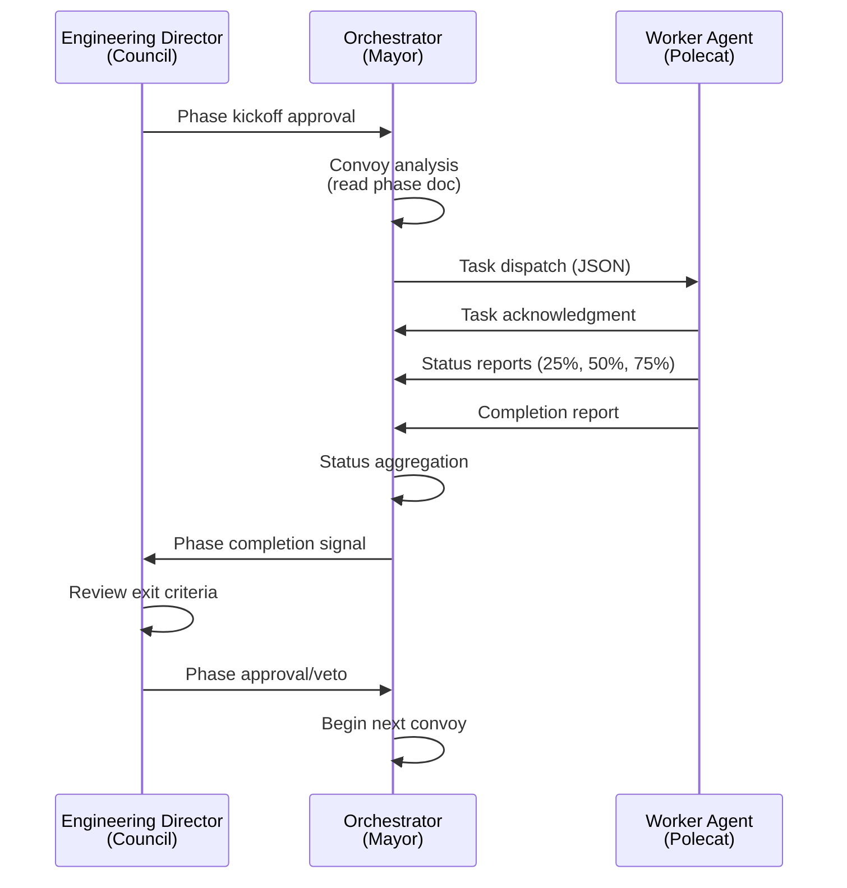

# Gastown MEOW Protocol for Antigravity IDE Agents

## Overview
This document defines the **MEOW (Mayor-Enhanced Orchestration Workflow)** protocol for multi-agent coordination in the `cc-mirror-ag-state-bridge` project. Based on [steveyegge/gastown](https://github.com/steveyegge/gastown), this protocol enables active collaboration between specialized agents instead of idle waiting.

## Architecture Mapping

| Gastown Concept | Our Implementation | Conversation ID |
|-----------------|-------------------|-----------------|
| **Mayor 🎩** | Orchestrator | e20afd38 |
| **Polecats 🦨** | Worker Agents | Various (backend, security, QA, etc.) |
| **Council 🏛️** | Engineering Director | 5c053cb6 |
| **Convoy 🚚** | Phase Document | `docs/phases/phase-N-*.md` |
| **Beads Issue** | Story File | `stories/**/*.story.md` |
| **Hook 🪝** | Git Worktree | (Future - persistent state) |

## MEOW Workflow



## JSON Message Schemas

### 1. Convoy Analysis (Orchestrator → Self)
```json
{
  "action": "convoy_analysis",
  "phase": "phase-2-context-injection",
  "tasks_identified": ["P2-001", "P2-002", "P2-003", "P2-004"],
  "dependencies": {
    "P2-003": ["P2-001"],
    "P2-004": ["P2-001"]
  }
}
```

### 2. Task Dispatch (Orchestrator → Worker)
```json
{
  "action": "dispatch",
  "convoy": "phase-2-context-injection",
  "task_id": "P2-001",
  "assigned_to": "backend-engineer",
  "story_file": "stories/backend/20260107_context_injector.story.md",
  "acceptance_criteria": [
    "Create src/core/context-injector.ts",
    "Unit tests with ≥90% coverage"
  ],
  "dependencies": [],
  "status": "dispatched",
  "adapter_ref": "skills/backend-engineer/adapter.md"
}
```

### 3. Task Acknowledgment (Worker → Orchestrator)
```json
{
  "action": "task_ack",
  "task_id": "P2-001",
  "agent": "backend-engineer",
  "status": "accepted",
  "estimated_duration": "45m",
  "start_time": "2026-01-07T13:45:00Z"
}
```

### 4. Status Report (Worker → Orchestrator)
```json
{
  "action": "status_report",
  "task_id": "P2-001",
  "agent": "backend-engineer",
  "status": "in_progress",
  "progress": 65,
  "artifacts_created": ["src/core/context-injector.ts"],
  "blockers": [],
  "next_steps": "Writing unit tests",
  "timestamp": "2026-01-07T14:15:00Z"
}
```

### 5. Completion Report (Worker → Orchestrator)
```json
{
  "action": "completion_report",
  "task_id": "P2-001",
  "agent": "backend-engineer",
  "status": "complete",
  "artifacts": ["src/core/context-injector.ts", "tests/unit/context-injector.test.ts"],
  "test_coverage": 94,
  "acceptance_criteria_met": [
    "Create src/core/context-injector.ts ✅",
    "Unit tests with ≥90% coverage ✅"
  ],
  "completion_time": "2026-01-07T14:30:00Z"
}
```

### 6. Status Aggregation (Orchestrator → Self)
```json
{
  "action": "status_summary",
  "convoy": "phase-2-context-injection",
  "task_status": {
    "P2-001": {"status": "complete", "progress": 100},
    "P2-002": {"status": "in_progress", "progress": 50},
    "P2-003": {"status": "blocked", "progress": 0, "blocked_by": ["P2-001"]},
    "P2-004": {"status": "pending", "progress": 0}
  },
  "overall_progress": 37,
  "blockers": []
}
```

### 7. Phase Completion Signal (Orchestrator → Director)
```json
{
  "action": "phase_completion_signal",
  "convoy": "phase-2-context-injection",
  "all_tasks_complete": true,
  "coverage": 94,
  "security_cleared": true,
  "integration_tests": "passing",
  "recommendation": "approve_transition",
  "next_phase": "phase-3-oauth-credentials"
}
```

### 8. Phase Approval (Director → Orchestrator)
```json
{
  "action": "phase_approval",
  "phase": "phase-2-context-injection",
  "decision": "approved",
  "review_notes": "All criteria met. Proceed to Phase 3.",
  "next_phase": "phase-3-oauth-credentials",
  "orchestrator_action": "begin_phase_3_convoy_analysis"
}
```

### 9. Blocker Escalation (Worker → Orchestrator)
```json
{
  "action": "blocker_escalation",
  "task_id": "P2-001",
  "agent": "backend-engineer",
  "status": "blocked",
  "blocker_type": "dependency",
  "description": "Waiting for AG session schema v2.0 spec",
  "suggested_action": "Escalate to product-manager"
}
```

### 10. Heartbeat (Keep-Alive)
**Worker Idle Heartbeat:**
```json
{
  "action": "heartbeat",
  "agent": "backend-engineer",
  "status": "idle",
  "last_task_completed": "P2-001",
  "ready_for_work": true,
  "timestamp": "2026-01-07T14:15:00Z"
}
```

**Orchestrator Polling:**
```json
{
  "action": "poll_workers",
  "convoy": "phase-2-context-injection",
  "workers": ["backend-engineer", "security-engineer", "qa-engineer"],
  "request": "status_update",
  "timestamp": "2026-01-07T14:15:00Z"
}
```

**Engineering Director Status Request:**
```json
{
  "action": "director_status_request",
  "phase": "phase-2-context-injection",
  "requested_from": "orchestrator",
  "timestamp": "2026-01-07T14:15:00Z"
}
```

## Protocol Rules

### For All Agents
1. **Always output valid JSON** - no markdown except in `notes` or `reasoning` fields
2. **Include timestamps** - ISO 8601 format (`2026-01-07T13:45:00Z`)
3. **Quote task IDs** - use exact format from phase docs (`P2-001`, not `P2-1`)
4. **No work without dispatch** - workers wait for orchestrator task assignment

### For Orchestrator (Mayor)
1. **Read phase docs first** - always start with convoy analysis
2. **Track dependencies** - never dispatch blocked tasks
3. **Aggregate status** - collect reports before signaling completion
4. **Never implement** - coordinate only, workers do the work

### For Workers (Polecats)
1. **Acknowledge immediately** - send `task_ack` upon dispatch
2. **Report milestones** - 25%, 50%, 75%, 100% progress
3. **Escalate blockers** - don't wait, report immediately
4. **Self-terminate** - mark complete and await next dispatch

### For Engineering Director (Council)
1. **Strict gatekeeping** - never approve incomplete phases
2. **Security mandatory** - always require security clearance
3. **Document decisions** - include detailed review notes
4. **Strategic oversight** - govern, don't implement

## Cascade Deployment & Keep-Alive Loops

### Orchestrator Loop (30s interval)
```
LOOP:
  1. Read phase document for new/updated tasks
  2. Poll all workers for status updates
  3. Aggregate status into status_summary JSON
  4. Check if phase complete → signal Director
  5. Wait 30 seconds
  6. Repeat until Director signals stop
```

### Worker Loop (60s interval when idle)
```
LOOP:
  1. Check for new task dispatches from Orchestrator
  2. If no task assigned for >60s:
     - Send heartbeat JSON with idle status
  3. If task assigned:
     - Switch to progress reporting mode
     - Report at 25%, 50%, 75%, 100%
  4. If blocked:
     - Immediately escalate, don't wait for interval
  5. Repeat
```

### Engineering Director Loop (120s interval)
```
LOOP:
  1. Check for phase completion signals from Orchestrator
  2. Every 120 seconds:
     - Request status summary from Orchestrator
     - Review against governance checklist
  3. If completion signal received:
     - Perform phase review
     - Output approval/veto/revision JSON
  4. Repeat
```

### Loop Activation Declaration
All agents MUST declare in their wake response:
```
⚡ LOOP MODE: ACTIVE - [description of loop behavior]
```

This signals to themselves and the system that they will **continue operating** instead of going idle after one response.

## Active Coordination Pattern

### Traditional (Idle):
```
User → Agent: "Do task X"
Agent → User: "Task X done"
Agent → Idle state
```

### MEOW (Active):
```
Director → Orchestrator: "Begin Phase 2"
Orchestrator → Workers: [Dispatches JSON tasks]
Workers → Orchestrator: [Progress reports]
Orchestrator → Director: [Completion signal]
Director → Orchestrator: [Approval]
Orchestrator → Workers: [Begin Phase 3]
(No idle state - continuous coordination)
```

## Error Recovery

### Worker Crash
1. Orchestrator detects missing status reports
2. Orchestrator reassigns task to another worker
3. Orchestrator logs crash for COPRO analysis

### Orchestrator Crash
1. Engineering Director notices silence
2. Director spawns new orchestrator instance
3. New orchestrator reads phase docs and resumes

### Director Unavailable
1. Orchestrator continues aggregating status
2. Orchestrator queues completion signal
3. Orchestrator alerts when director returns

## Persistent State (Future)

Gastown uses git worktrees (hooks) for persistence. For Phase 1:
- **Current:** Agent state is conversational only
- **Future:** Implement git-backed hooks in `.gastown/hooks/`
- **Benefit:** Work survives agent crashes and IDE restarts

## References
- [Gastown GitHub](https://github.com/steveyegge/gastown)
- [MEOW Workflow](https://github.com/steveyegge/gastown#meow-mayor-enhanced-orchestration-workflow)
- [cc-mirror PRD](file:///home/kasm-user/workspace/dspy/cc-mirror-ag-state-bridge/docs/PRD_v2.0.md)
