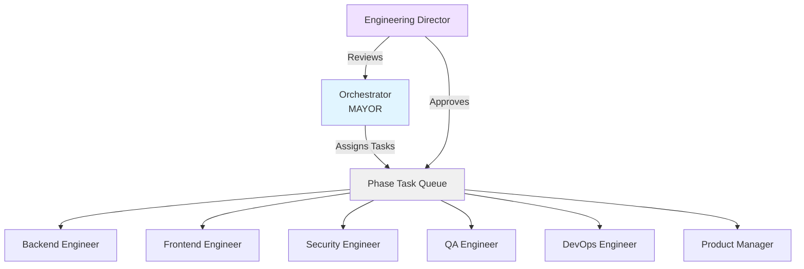

# Implementation Plan: Gastown-Style Multi-Agent Architecture

## Overview
This document outlines the phased implementation of a Gastown-inspired multi-agent workflow for the `cc-mirror-ag-state-bridge` project. The architecture enables an **Orchestrator (MAYOR)** to continuously monitor project state and dispatch tasks to specialized **Worker** agents.

---

## Architecture



### Core Concepts (Adapted from Gastown)
| Gastown Concept | Our Adaptation |
|-----------------|----------------|
| **Mayor** | `orchestrator` role - continuously runs, breaks down goals, assigns tasks |
| **Polecats** | Worker roles (backend, frontend, etc.) - spawn, complete task, terminate |
| **Hooks** | Git worktrees or session files for persistent agent state |
| **Convoys** | Phase documents in `/docs/phases/` tracking bundled tasks |
| **Engineering Director** | High-level reviewer, approves phase transitions |

---

## Implementation Phases

### Phase 1: State Bridge Foundation (Weeks 1-2)
| Task ID | Description | Worker Role | Status |
|---------|-------------|-------------|--------|
| P1-001 | Implement `SessionDiscovery` class | Backend Engineer | ⬜ |
| P1-002 | Implement `SessionParser` class | Backend Engineer | ⬜ |
| P1-003 | Add unit tests for discovery/parsing | QA Engineer | ⬜ |
| P1-004 | Define acceptance criteria for AG sessions | Product Manager | ⬜ |

### Phase 2: Context Injection (Weeks 3-4)
| Task ID | Description | Worker Role | Status |
|---------|-------------|-------------|--------|
| P2-001 | Implement `ContextInjector` class | Backend Engineer | ⬜ |
| P2-002 | Add CLI command `--continue-from-ag` | Frontend Engineer | ⬜ |
| P2-003 | Security review of context handling | Security Engineer | ⬜ |
| P2-004 | Integration tests for context flow | QA Engineer | ⬜ |

### Phase 3: OAuth & Credential Management (Weeks 5-6)
| Task ID | Description | Worker Role | Status |
|---------|-------------|-------------|--------|
| P3-001 | Implement OS keychain integration | Backend Engineer | ⬜ |
| P3-002 | OAuth token refresh logic | Security Engineer | ⬜ |
| P3-003 | CI/CD pipeline for multi-platform | DevOps Engineer | ⬜ |
| P3-004 | End-to-end testing and validation | QA Engineer | ⬜ |

---

## Role Definitions

### Orchestrator (MAYOR)
- **Location:** `skills/orchestrator/SKILL.md`
- **Behavior:** Always running. Monitors phase documents. Breaks down goals into tasks. Dispatches to workers.
- **Lifecycle:** Continuous loop until all phases complete.

### Engineering Director
- **Location:** `skills/engineering-director/SKILL.md`
- **Behavior:** Reviews completed phases. Approves phase transitions. Provides high-level guidance.
- **Lifecycle:** Invoked by MAYOR at phase boundaries.

### Worker Roles (Polecats)
- Backend, Frontend, Security, QA, DevOps, Product Manager
- **Behavior:** Pick up assigned task. Execute. Terminate when done.
- **Lifecycle:** Ephemeral per-task.

---

## MEOW Workflow (Adapted)

1. **MAYOR Reads Phase Docs:** Orchestrator scans `/docs/phases/` for pending tasks.
2. **Task Breakdown:** MAYOR analyzes task, selects appropriate worker.
3. **Dispatch:** Worker is tasked with specific P#-### item.
4. **Execution:** Worker completes task, produces code changes.
5. **Validation:** QA or Security worker validates outputs.
6. **Phase Transition:** When all tasks in a phase are ✅, Engineering Director approves.
7. **Loop:** MAYOR moves to next phase.

---

## File Structure

```
cc-mirror-ag-state-bridge/
├── docs/
│   ├── phases/
│   │   ├── phase-1-foundation.md
│   │   ├── phase-2-context-injection.md
│   │   └── phase-3-oauth-credentials.md
│   └── IMPLEMENTATION_PLAN.md  (this file)
├── skills/
│   ├── orchestrator/
│   │   ├── SKILL.md
│   │   └── adapter.md
│   ├── engineering-director/
│   │   ├── SKILL.md
│   │   └── adapter.md
│   └── ... (existing worker roles)
└── ...
```

---

## Next Steps
1. Create `skills/orchestrator/SKILL.md` and `adapter.md`
2. Create `skills/engineering-director/SKILL.md` and `adapter.md`
3. Create phase documents in `docs/phases/`
4. Run COPRO optimization on new roles
